# FeedForward-StyleGAN2-Distillation

A feedforward distillation of StyleGAN2 architecture ensembled with pix2pixhd to encompass certain feature morphing capabilities via its latent variable mapping architecture, such as sex and varying the extents of attributes. Based on EvgenyKashins paper https://arxiv.org/abs/2003.03581. This paired image-to-image translation, trained on synthetic data generated by StyleGAN2 outperforms existing approaches in image manipulation. 

StyleGAN2 is a generative model made by Nvidia. This model possesses certain feature morphing capabilities via its latent variable mapping architecture and varying the extents of attributes. Standalone, its only function is generation of images that do not exist.
For this project I have made use of StyleGAN2-ffhq-config-e which generates facial data.

The aim of this project is to distill these capabilities into a pipeline model that is trained on latent variables thhat encompass this attributes.
The mathematics used is based on a combination of Evgeny Kashins research paper and the linear algebra manipulation I derived that was specific to my desired outputs.

The steps include:
- Manipulating and using the StyleGAN2 repository by NVlabs to suit data generation and manipulation.

||| 
|:----:|:----:|
|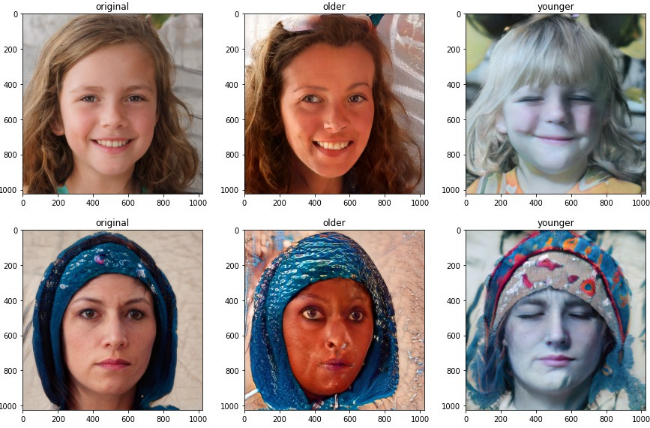|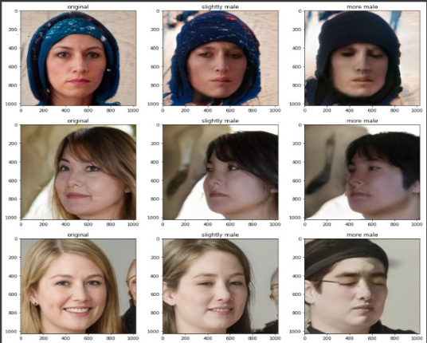| 

- Extracting the intermediate latent variables( and choosing the right ones) and proceeding to shift characteristics based on certain mathematical equations

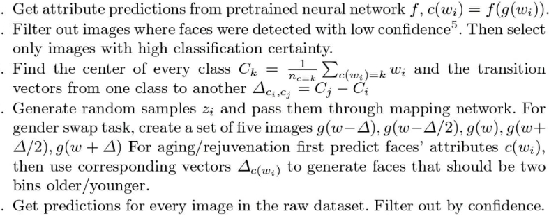

This would lead to a pair dataset generation that visually encompasses the shift in its latent code.

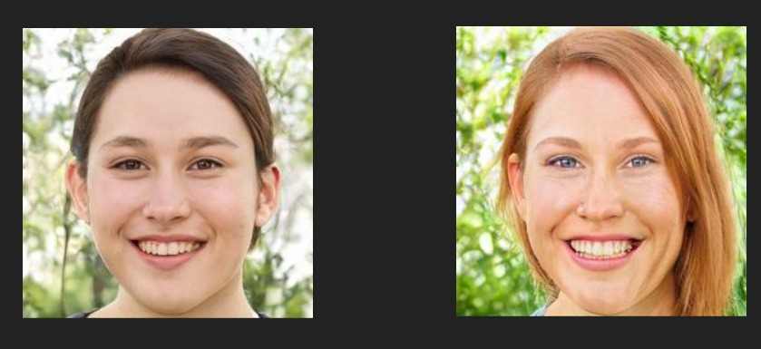

This pair is trained through a pipeline model that accepts two sets A- the non modified visual data and B- the modified equivalents and trains the pipeline to perform a similar manipulation.

The outputs of this pipeline train weren't perfect even after 12 hours of continuous training after downscaling to 256p. But as the transfer and model improvement were significantly apparent, the training was concluded.

### Generated image progression over 200 epochs

The training is deemed succesful as the quality of the generated image as well as the generated features improved significantly over the 200 epochs.
|EPOCH 7|EPOCH 50|EPOCH 150|EPOCH 200|
|:----:|:----:|:----:|:----:|
|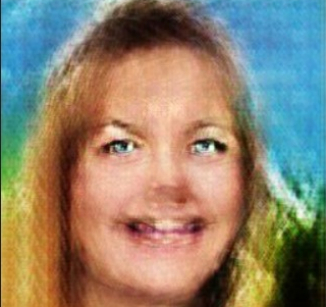|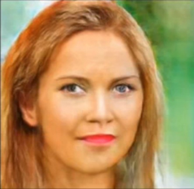| 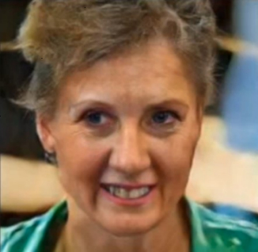| 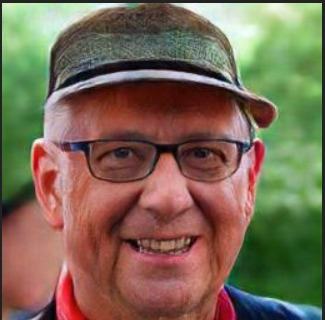|

New images fed to this model now output a more feminine version of the person. This was tested on the celeb-A dataset by tensorflow

### Celeb-A Dataset Results

### Pair-to-Pair translation results:

| | | | | | |
|:----:|:----:|:----:|:----:|:----:|:----:|
|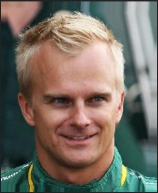|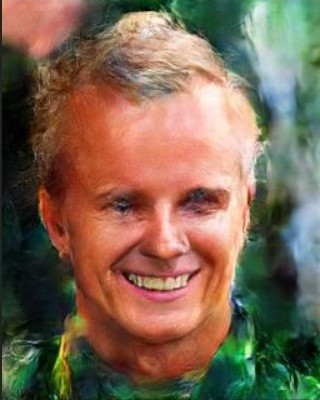|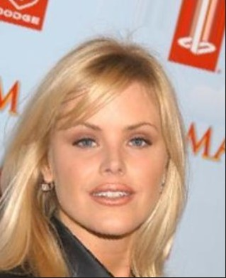|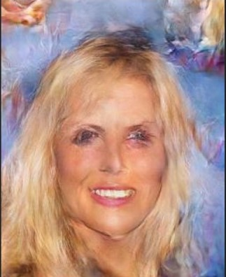|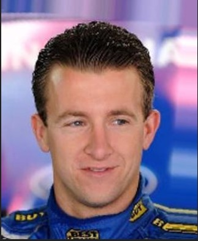|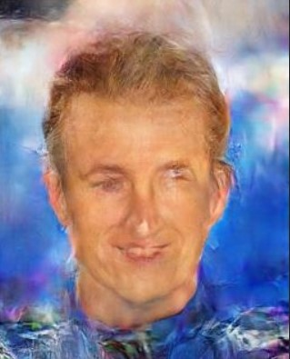|

## Face Morphing

Performs a shift from one face to another based on the following interpolation equation in terms of the latent mapping representation:

### Results:

||| 
|:----:|:----:|
||| 

## Expression Transfer

Performs variation of smiling and frowning although it could be improved with a purer latent distillation and inclusion of features like eye concavity, nose flare and brow arch.

### Results:

||| 
|:----:|:----:|
|||

